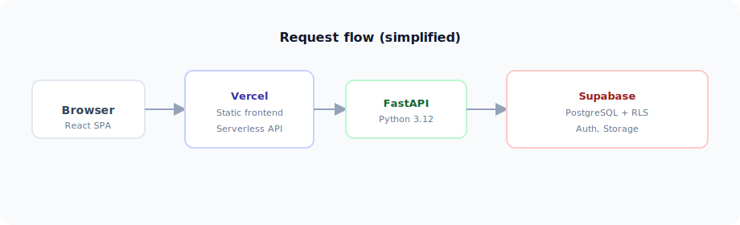

<p align="center">
  
</p>

<p align="center">
  
</p>

<p align="center">
  A free, open-source learning management system built for Bible schools,
  church ministries, and nonprofit educational programs.
</p>

<p align="center">
  <a href="https://github.com/ArVaViT/biblie-school/blob/main/LICENSE">
    
  </a>
  <a href="https://github.com/ArVaViT/biblie-school/actions/workflows/backend-ci.yml">
    
  </a>
  <a href="https://github.com/ArVaViT/biblie-school/actions/workflows/frontend-ci.yml">
    
  </a>
  <a href="https://github.com/ArVaViT/biblie-school/issues?q=is%3Aissue+is%3Aopen+label%3A%22good+first+issue%22">
    
  </a>
</p>

<p align="center">
  <a href="https://biblie-school-frontend.vercel.app"><strong>Live demo</strong></a> &middot;
  <a href="ROADMAP.md">Roadmap</a> &middot;
  <a href="CONTRIBUTING.md">Contributing</a> &middot;
  <a href="CHANGELOG.md">Changelog</a>
</p>

---

## Table of contents

- [Why this project?](#why-this-project)
- [Screenshots](#screenshots)
- [Architecture](#architecture)
- [Observability](#observability)
- [Features](#features)
- [Tech stack](#tech-stack)
- [Quick start](#quick-start)
- [Project structure](#project-structure)
- [Contributing](#contributing)
- [For nonprofits](#for-nonprofits)
- [Community](#community)
- [License](#license)

---

## Why this project?

Hundreds of small Bible schools, home churches, and missionary training
programs around the world still manage courses on paper, WhatsApp, or
spreadsheets. Commercial LMS platforms are expensive, overkill, or require
technical expertise that volunteer-run organizations simply don't have.

**Bible School LMS** is designed to change that:

- **Free forever** — MIT-licensed, no paywalls, no "premium" tiers.
- **Simple to deploy** — one-click Vercel deploy with a free Supabase
  database. No Docker, no servers to manage.
- **Built for small scale** — optimized for 20-100 students, not enterprise
  pricing models.
- **Contributor-friendly** — clear docs, conventional commits, issue
  templates, and a welcoming community.

---

## Screenshots

<p align="center">
  
</p>

**Wireframe preview** (above) always renders in GitHub; swap it for real captures when ready.

Add PNG or WebP files under [`docs/readme/screenshots/`](docs/readme/screenshots/) and reference them here, for example:

| Student dashboard | Course reader | Teacher gradebook |
|:---:|:---:|:---:|
| `dashboard.png` | `course-reader.png` | `gradebook.png` |

Suggested filenames: `dashboard-light.png`, `dashboard-dark.png`, `quiz-taking.png`, `editor-chapter.png`. Keep captures **1280–1600px wide** and compress (e.g. `pngquant` or WebP) so the README stays fast.

---

## Architecture

<p align="center">
  
</p>

---

## Observability

The frontend can send **opt-in** analytics to **Datadog RUM** when `VITE_DATADOG_*` variables are set (`frontend/src/lib/datadog.ts`). Session Replay and Core Web Vitals can be reviewed in your Datadog org — useful for demos to sponsors or infra-minded contributors.

If you export a **sanitized** screenshot (no PII, no session tokens), you can place it as `docs/readme/screenshots/datadog-rum-overview.png` and add a row under Screenshots. Never commit API keys or application secrets.

---

## Features

| Area | What you get |
|------|-------------|
| **Course authoring** | Courses, modules, chapters, rich content blocks (TipTap editor with images, YouTube, callouts, audio) |
| **Assessments** | Multiple-choice, true/false, short-answer, and essay quizzes with attempt limits and teacher grading |
| **Assignments** | Student submissions, grading queue, automatic chapter completion |
| **Progress tracking** | Per-chapter progress, module/course completion, enrollment management |
| **Certificates** | Auto-generated certificates with teacher approval flow |
| **Teacher tools** | Gradebook, analytics dashboard, cohort management, calendar, announcements |
| **Admin tools** | User management, bulk operations, CSV export, course cloning, soft delete |
| **Design** | Editorial aesthetic, dark/light theme, responsive (360px+), OKLCH semantic tokens |
| **Security** | RLS on every table, server-side HTML sanitization, CORS lockdown, audit pipeline |

---

## Tech stack

| Layer | Technology |
|-------|-----------|
| Frontend | React 18, TypeScript, Vite, Tailwind CSS, shadcn/ui, TipTap, Radix |
| Backend | Python 3.12, FastAPI, SQLAlchemy 2, Pydantic 2 |
| Database | PostgreSQL (Supabase) with Row Level Security |
| Auth | Supabase Auth (Google OAuth + email/password) |
| Storage | Supabase Storage (avatars, course assets, materials) |
| Deploy | Vercel (static frontend + Python serverless backend) |
| CI/CD | GitHub Actions (lint, typecheck, test, audit) + Dependabot |

---

## Quick start

### Prerequisites

- **Node.js** >= 20, **npm** >= 10
- **Python** 3.12
- A free [Supabase](https://supabase.com) project (or just run backend
  tests with SQLite — no Supabase needed)

### 1. Clone and install

```bash
git clone https://github.com/ArVaViT/biblie-school.git
cd biblie-school

# Frontend
cd frontend && npm ci && cd ..

# Backend
cd backend && pip install -r requirements.txt && cd ..
```

### 2. Configure environment

```bash
cp frontend/.env.example frontend/.env.local   # fill in VITE_* vars
cp backend/.env.example  backend/.env           # fill in Supabase creds
```

See each `.env.example` for a description of every variable.

### 3. Start development

```bash
# Terminal 1 — API
cd backend && uvicorn app.main:app --reload     # http://localhost:8000

# Terminal 2 — SPA
cd frontend && npm run dev                      # http://localhost:5173
```

### 4. Run tests

```bash
cd backend  && python -m pytest tests/    # 396+ tests (SQLite in-memory)
cd frontend && npm run test:run           # Vitest + jsdom
```

---

## Project structure

```
backend/            Python FastAPI application
  app/
    api/v1/         Route modules
    core/           Config, database, auth helpers
    models/         SQLAlchemy ORM models
    schemas/        Pydantic request/response schemas
    services/       Business logic
  tests/            pytest suite

frontend/           React SPA (Vite + TypeScript)
  src/
    components/     UI components (shadcn/ui + custom)
    pages/          Route-level pages
    services/       API client + Supabase helpers
    context/        React contexts (auth, theme)

supabase/
  migrations/       SQL migration files (production schema source of truth)

docs/
  readme/           README artwork (SVG) and optional screenshots/

.github/
  workflows/        CI pipelines
  ISSUE_TEMPLATE/   Bug report and feature request forms
```

---

## Contributing

We welcome contributions of all sizes — from typo fixes to new features.

1. Read [CONTRIBUTING.md](CONTRIBUTING.md) for setup and workflow details.
2. Check [open issues](https://github.com/ArVaViT/biblie-school/issues)
   — look for the `good first issue` label if you're new.
3. See the [ROADMAP](ROADMAP.md) for bigger-picture direction.

**We especially welcome:**
- Nonprofit Bible schools sharing their real-world needs
- Designers improving the student/teacher experience
- Translators helping make the platform multilingual
- QA testers finding and reporting bugs

---

## For nonprofits

If you're a Bible school, ministry, or educational nonprofit considering
this platform:

- **It's free.** MIT license means you can use, modify, and deploy it with
  zero cost.
- **No vendor lock-in.** Host it yourself or use the free tiers of Vercel +
  Supabase.
- **You don't need a developer on staff.** Follow the quick start above, or
  open a [discussion](https://github.com/ArVaViT/biblie-school/discussions)
  and the community will help.
- **Your feedback shapes the product.** Open a feature request — the roadmap
  is driven by real ministry needs.

---

## Community

- [GitHub Discussions](https://github.com/ArVaViT/biblie-school/discussions) — questions, ideas, show & tell
- [Issue tracker](https://github.com/ArVaViT/biblie-school/issues) — bug reports and feature requests
- [Changelog](CHANGELOG.md) — what's new in each release
- [Security policy](SECURITY.md) — how to report vulnerabilities

---

## License

[MIT](LICENSE) — free for personal, educational, and commercial use.
